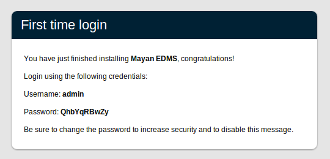

================================
Mayan EDMS v0.12.3 release notes
================================

*October 2012*

This is the third maintenance release of the 0.12 series.

Overview
========

Once again the focus for this release in the 0.12 series is including
bug fixes and minor feature.  `issue #31`_ has been implemented adding bulk
document tagging and untagging.

What's new in Mayan EDMS v0.12.3
================================

Django 1.3.3
~~~~~~~~~~~~

Per document type indexing
~~~~~~~~~~~~~~~~~~~~~~~~~~
**Mayan EDMS** creates a administrator user during the
database creation phase to reduce the amount of steps required for a
functional install.  The creation of this account is controlled by the configuration
option :setting:`COMMON_AUTO_CREATE_ADMIN`, the username of the account is
specified with the configuration option :setting:`COMMON_AUTO_ADMIN_USERNAME`
and the password of this account by the option :setting:`COMMON_AUTO_ADMIN_PASSWORD`.
Previously the :setting:`COMMON_AUTO_ADMIN_PASSWORD` defaulted to 'admin' which
created an administrator account of username 'admin' with a password of
'admin'.  The new default is to randomize an initial password and show this password
at the login screen until the administrator password is changed.

Document check outs
~~~~~~~~~~~~~~~~~~~
As per the feature request filed under `issue #26`_, a new document
check out and check in functionality has been added.  Users can now
check out a document and lock new version of it from being uploaded to avoid
editing conflicts.  Document check outs have an expiration period after which
**Mayan EDMS** will automatically check them back in to avoid a permanent
document lockout.  Only the user who has checked out a document can upload
new versions of it or check the document back in before the expiration period,
unless being granted the ``Allow overriding check out restrictions`` or 
``Forcefully check in documents`` permission respectively.

Installation environment app improvements
~~~~~~~~~~~~~~~~~~~~~~~~~~~~~~~~~~~~~~~~~
Diagnosting remote installations of web based applications without access to the
command line can be a bit hard, to alleviate this situation a new installation
environment details app has been added.  The purpose of this app is to provide
support staff information about the physical environment where **Mayan EDMS** has
been installed.  To avoid possible security compromises only administrators
can access this app.

Translation updates
~~~~~~~~~~~~~~~~~~~

General fixes
~~~~~~~~~~~~~
Unique fields in the DocumentType model, MetadataSet label

Upgrading from a previous version
=================================

Start off by adding the new requirements::

    $ pip install -r requirements/production.txt

Migrate existing database schema with::

    $ ./manage.py migrate document_indexing
    $ ./manage.py migrate metadata 0001 --fake
    $ ./manage.py migrate metadata
    $ ./manage.py migrate documents

Add new static media::

    $ ./manage.py collectstatic --noinput

The upgrade procedure is now complete.

Backward incompatible changes
=============================
* None

Bugs fixed
==========
* `issue #31`_ "Bulk add tags Feature request"
* `issue #32`_ "Error run $python manage.py syncdb"

.. _issue #31: https://github.com/rosarior/mayan/issues/31
.. _issue #32: https://github.com/rosarior/mayan/issues/32
