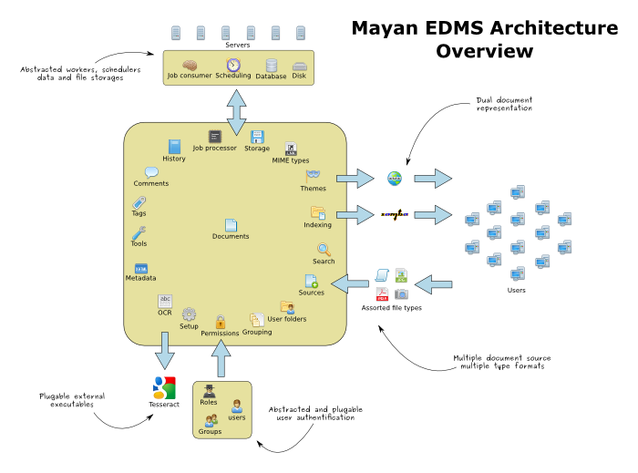

.. _internals:

=========
Internals
=========

|architecture|

**Mayan EDMS** is not a single program, but a collection of different Django apps, each designed to provide a specific functionality.

* common - Holds code and provide a central place to put code thats used by all the other apps.
* document_indexing
* history
* main - Can be thought as the project app, is small on purpose.
* navigation - Handles the complex automatic creation of hyper text links.
* project_setup
* scheduler
* storage - Abstracts the storage of documents.
* web_theme - Handles the presentation of the HTML and CSS to the user.
* converter - Abstracts the convertions between file formats, calls the backends of which are wrappers for ImageMagick, GraphicsMagick and python's PIL coupled with ghostscript.
* documents - The main app, handles the Document and DocumentPage classes.
* folders
* job_processor
* metadata
* ocr
* project_tools
* smart_settings
* tags - Handles Document tagging, it is a wrapper for django-taggit_.
* document_comments - Handles document comments it's a wrapper for `Django\'s comment framework`_.
* dynamic_search
* grouping
* mimetype - Handles file mimetype detection using python-magic or falling back to Pythons mimetype library, also handles the mimetype icon library.
* permissions - All the other apps register their permissions with this one.
* sources - Handles the document file sources definitions.
* user_management - User and group management, it is a wrapper for Django's user creating and authentication system.

.. _`Django\'s comment framework`: https://docs.djangoproject.com/en/dev/ref/contrib/comments/
.. _django-taggit:  https://github.com/alex/django-taggit
