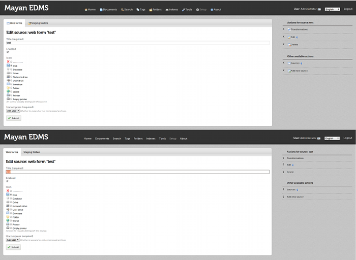

=============
Customization
=============

The general appearance of **Mayan EDMS** can be customized entirely just
by changing a few settings.

------
Themes
------
**Mayan EDMS** uses `Andrea Franz's excellent web app template`_ which includes
several themes that could be used to adapt **Mayan EDMS**'s appearance to match
an organtization existing applications' look and feel.

The theme can be changed very easily by settings the :setting:`WEB_THEME_THEME`
configuration option to one of its valid values.

.. image:: themes.png
 :alt: themes

------------
Login screen
------------
The amount of information presented at the login screen can also be restricted
if for security or desgin reasons using :setting:`WEB_THEME_VERBOSE_LOGIN`
configuration option.

.. image:: mayan-login.png
 :alt: mayan login screen

-----------
Home screen
-----------
Sometimes users just want to go directly to work and not just be greeted with
a home screen, for these kind of situations **Mayan EDMS** has the
:setting:`MAIN_DISABLE_HOME_VIEW` configuration option which will cause
users to land on their ``recent document list`` as soon as they log in.

-----
Icons
-----
Some themes such as ``default`` might be more visually appealing to some
people without the menu icons, for this **Mayan EDMS** provides the
:setting:`MAIN_DISABLE_ICONS` configuration option.

.. _`Andrea Franz's excellent web app template`: https://github.com/pilu/web-app-theme
