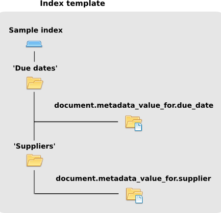
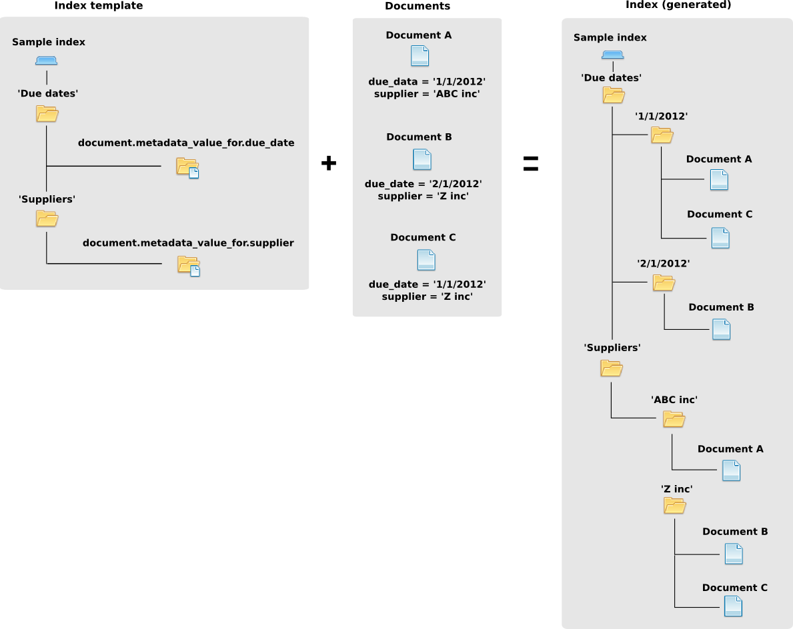

=======
Indexes
=======
To configure: |Setup tab| |Right arrow| |Indexes button| |Right arrow| |Tree template link|

To use: |Index tab|

Indexes are an automatic method to hierarchically organize documents in relation to their metadata and to each other.

Index templates
===============

Since multiple indexes can be defined, the first step is to create an empty index.
Administrators then define the tree template showing how the index will be structured.
Each branch can be a pseudo folder, which can hold other child 'folders' or
a document container which will have all the links to the documents that
matched the path to reach the document container.

Index instances
===============

The template is the skeleton from which an instance of the index is then
auto-populated with links to the documents depending on the rules of each
branch of the index evaluated against the metadata and properties of the documents.

.. _Samba: http://www.samba.org/

.. |Setup tab| image:: /_static/setup_tab.png
 :alt: Setup tab
 :align: middle

.. |Right arrow| image:: /_static/arrow_right.png
 :alt: Right arrow
 :align: middle

.. |Indexes button| image:: /_static/indexes_button.png
 :alt: Indexes button
 :align: middle

.. |Tree template link| image:: /_static/tree_template_link.png
 :alt: Tree template link
 :align: middle

.. |Index tab| image:: /_static/index_tab.png
 :alt: Index tab
 :align: middle
