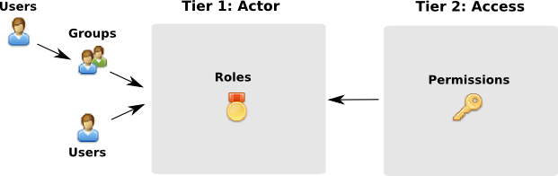
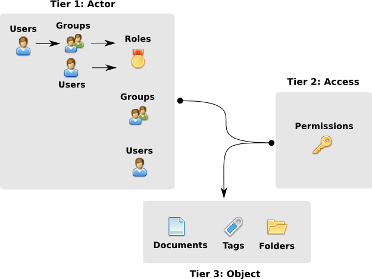

===========
Permissions
===========

**Mayan EDMS** provides very exact control over what activies users can 
perform.  This control is divided into two levels of operation:

2 tier permissions assignement
==============================

This level of activity control works
by allowing roles that are composed of users and group, to be granted
a permission such that the holder of that permission can exercise it
throught the entire collection of objects (document, folders, tags, etc),
this method could be thought out as a global permission granting level.
Example: Roles being granted the ``Document view`` permission will be able to view
**all** documents in existance.

  
  
3 tier access control
=====================
  
When more control is desired over which objects
actors(user, groups and roles) can exercise an action this method should be
used.  Under this level, actors are granted a
permission but only in relation to a selected object.  Example: Granting user
``Joe`` the ``Document view`` access control for document ``Payroll``,
would allow him to view this document only.

  
The permission system enforces inheritance by first checking if the user
has a global permission, is a member of a group or a role that has a global
permission and if not then checks to see if that user, a group or role to
which he belongs, has been granted access to the specific object to which
he is desiring to perform a given action that requires a permission.
Only when these checks fails the user
is forbidden to perform the action and a generic message indicating this is
displayed to avoid providing any information that could be used to sidetrack
the permission system or obtain any kind of information about the object
from which the user was not allowed access.

Default Access Control Lists (Default ACLs)
-------------------------------------------

**Mayan EDMS** allows assigment of permissions to Users to access objects after their instantiation from the class. This is implemented with so called Access Control List. The document ``Payroll`` is example of instance of class ``Documents``. A user can be granted with access to only one instance of the class ``Documents`` - the document ``Payroll``. 

Along with Access Control Lists there are Default Access Control Lists.They provide additional functionality. It allows assigment of permissions to Users directly to the class before the instantiation. It will be explained with the following example:

**Example 1.** Each user can access only the documents that he uploads

This example will show how to restrict a user in order not to view documents uploaded by other users. The user will view only the documents that he uploades. It will work only for documents that are uploaded after the activation of the restriction. It will not work for documents prior to the activation of the restriction.

Follow the steps:
    1. Enter **Mayan EDMS** with user that has administrative rights.
    2. Go to Setup menu. Enter Default ACLs submenu.
    3. Click ``New holder`` next to the class Documents. From the list of users choose the special user Creator. Give the permission ``View Documents`` to the Creator.
    4. Go back to Setup menu. Go to Users and create the users ``Pedro`` and ``Sancho``. 
    5. Go back to Setup menu. Go to Groups and create the group ``Employees``. Click to members of the groups and add ``Pedro`` and ``Sancho`` to that group.
    6. Go back to Setup menu. Go to Roles submenu. Create the role Uploaders. Give the permission Create documents to the role. Add the group ``Employess`` as a member to that role.
    7. Now enter **Mayan EDMS** with ``Pedro`` and ``Sancho`` one after another and upload documents. Pedro should not see the documents that ``Sancho`` uploaded and vice versa. He should see only documents uploaded by himself.
